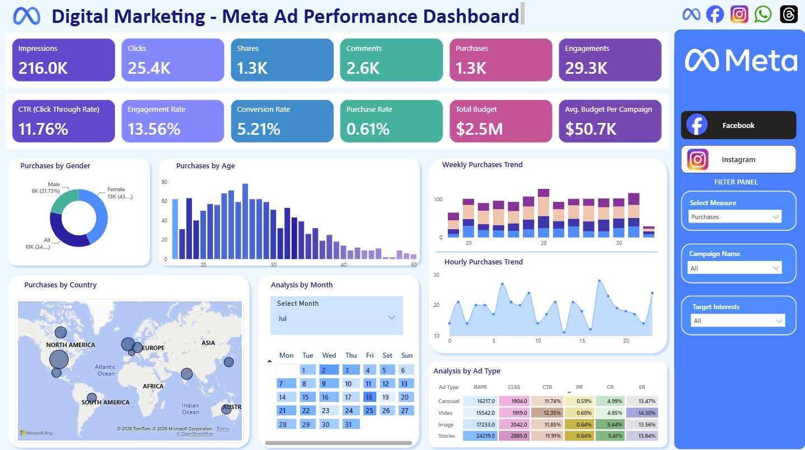

# Meta Ad Performance Analysis – Power BI Dashboard

---

## 📌 Project Overview
This Power BI dashboard provides a complete performance analysis of Meta (Facebook & Instagram) advertising campaigns.  
It evaluates campaign reach, engagement, conversions, audience behavior, and budget utilization across multiple dimensions such as gender, age, geography, ad type, and time.

The dashboard helps marketing teams optimize ad spend, improve targeting, and increase ROI by identifying high‑performing segments and funnel drop‑offs.

---

## 🎯 Business Objectives
The dashboard was built to help stakeholders:

- Identify the most effective platform (Facebook vs Instagram)
- Track campaign ROI and optimize budget allocation
- Understand audience engagement patterns
- Analyze conversion funnel efficiency
- Compare performance across ad types and demographics
- Detect seasonal and hourly engagement trends

---

## 📊 Key KPIs
- **Impressions** – Total times ads were displayed  
- **Clicks** – User interactions with ads  
- **Shares & Comments** – Organic engagement indicators  
- **Purchases** – Conversions from ads  
- **Engagements** – Clicks + Shares + Comments  
- **CTR (Click‑Through Rate)**  
- **Engagement Rate**  
- **Conversion Rate**  
- **Purchase Rate**  
- **Total Budget**  
- **Avg. Budget per Campaign**

---

## 📈 Dashboard Insights

### 1. Funnel Performance
- **Impressions:** 216K  
- **Clicks:** 25.4K  
- **CTR:** 11.76% (very strong)  
- **Purchases:** 1.3K  
- **Purchase Rate:** 0.61% (low)  

**Insight:**  
Top‑funnel performance is excellent (high CTR & engagement), but conversion efficiency is weak → landing page optimization needed.

---

### 2. Engagement by Gender
- Female: 43%  
- Male: 22%  
- Other/Not Specified: 35%  

**Insight:**  
Females engage significantly more → campaigns should prioritize female audiences.

---

### 3. Engagement by Age Group
- Peak engagement: **20–30 age group**  
- Drops sharply after 35+

**Insight:**  
Primary audience = young adults.

---

### 4. Geographic Distribution
Top engaged countries:
- US  
- India  
- Brazil  
- Germany  
- UK  

**Insight:**  
High‑volume markets: India & Brazil  
High‑value markets: Germany & UK

---

### 5. Weekly & Hourly Trends
- Weekly engagement is consistent  
- Hourly engagement peaks between **3 PM – 8 PM**  
- Lowest engagement early morning (0–5 AM)

**Insight:**  
Schedule ads during afternoon/evening for maximum ROI.

---

### 6. Calendar View
- Certain dates show spikes (19–21, 25–27)
- Likely due to promotions or campaign launches

**Insight:**  
Event‑based campaigns drive higher engagement.

---

### 7. Ad Type Performance (Matrix)
| Ad Type   | Impressions | Clicks | CTR   | Purchase Rate | Conversion Rate | Engagement Rate |
|-----------|-------------|--------|-------|----------------|------------------|------------------|
| Carousel  | 48K         | 6K     | 11.7% | 0.59%          | 5.1%             | 13.4%            |
| Image     | 51K         | 6K     | 11.7% | 0.57%          | 4.9%             | 13.5%            |
| Stories   | 72K         | 8K     | 11.8% | 0.65%          | 5.2%             | 13.6%            |
| Video     | 46K         | 5K     | 11.9% | 0.62%          | 5.2%             | 13.7%            |

**Insight:**  
Video ads perform best across CTR, CR, and ER → allocate more budget to Video & Stories.

---

## 📚 Domain Knowledge Summary

### Dataset Includes:
- Event‑level logs (impressions, clicks, purchases)
- Ad metadata (platform, type, targeting)
- Campaign details (budget, duration)
- User demographics (gender, age, country, interests)

### Star Schema:
- **Fact Table:** ad_events  
- **Dimension Tables:** ads, campaigns, users  

### Key Domain Concepts:
- CTR, CPC, CPM, ROAS  
- Audience segmentation  
- Funnel analysis  
- Budget optimization  
- Creative performance analysis  

---

## 🛠️ Technical Implementation

### Data Modeling
- Star schema  
- Fact table: ad_events  
- Dimensions: ads, campaigns, users  

### DAX Measures
- Impressions  
- Clicks  
- Shares  
- Comments  
- Purchases  
- CTR  
- Engagement Rate  
- Conversion Rate  
- Purchase Rate  
- Total Budget  
- Avg. Budget per Campaign  

### Power BI Features
- Donut Charts  
- Bar Charts  
- Map Visual  
- Calendar Heat Map  
- Stacked Column Chart  
- Area Chart  
- Matrix Table  
- KPI Cards  
- Dynamic measure switching  

---

### Digital Marketing - Meta Ad Performance Analysis Dashboard

---

## 📁 Project Files
- Power BI Report (`.pbix`)  
- Dataset (`.csv` / `.xlsx`)  
- BRD & Domain Documents (`.pdf`)  
- Dashboard Insights (`.pdf`)  

---

## 🚀 How to Use
1. Download the `.pbix` file  
2. Open in Power BI Desktop  
3. Refresh data if needed  
4. Use slicers to explore audience segments and ad types  

---

---

## 👤 Author
**Asha Topagi**  
Toronto, Canada

---
🤝 **Connect With Me**

I love collaborating on BI, data engineering, and analytics projects. 
Feel free to reach out or connect:

[LinkedIn](https://www.linkedin.com/in/ashatopagi)  |  [Email](mailto:asha.usa3@gmail.com)
