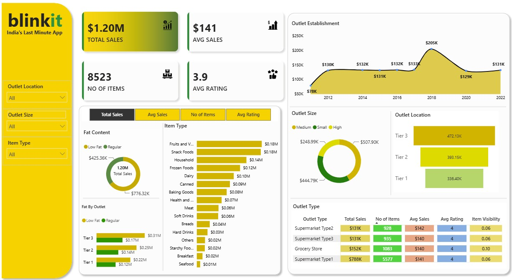

# Blinkit Sales Performance Dashboard – Power BI

---

## 📌 Project Overview
The **Blinkit Sales Performance Dashboard** is a Power BI analytics solution designed to evaluate Blinkit’s sales trends, outlet performance, customer ratings, and inventory distribution.  
It provides actionable insights for business stakeholders to optimize product strategy, outlet operations, and customer satisfaction.

---

## 🎯 Objectives
- Analyze total sales, average sales, item counts, and customer ratings  
- Compare performance across outlet types, sizes, and locations  
- Understand category‑wise revenue contribution  
- Evaluate fat content impact on sales  
- Identify trends based on outlet establishment year  

---

## 📊 Key KPIs
- **Total Sales**  
- **Average Sales**  
- **Number of Items Sold**  
- **Average Rating**

---

## 📈 Dashboard Insights

### 1. Sales by Fat Content
- Low Fat: **$425.36K**  
- Regular: **$776.32K**  
Regular items contribute ~65% of total sales.

### 2. Sales by Item Type
Top categories:
- Fruits & Vegetables – **$0.18M**  
- Snack Foods – **$0.18M**  
- Household – **$0.14M**

### 3. Outlet Tier Performance
Tier 3 outlets generate the highest revenue.

### 4. Outlet Establishment Trend
Outlets established in **2018** show peak performance.

### 5. Sales by Outlet Size
- High: **$507.90K**  
- Small: **$444.79K**  
- Medium: **$248.99K**

### 6. Outlet Type Comparison
Supermarket Type1 leads across all KPIs.

---

## 🛠️ Technical Implementation

### Data Modeling
- Star schema  
- Fact table: Sales  
- Dimension tables: Items, Outlets, Ratings  

### DAX Measures
- Total Sales  
- Average Sales  
- Total Items  
- Average Rating  
- Category‑wise Sales  
- Outlet‑wise Sales  

### Power BI Features
- KPI Cards  
- Slicers  
- Bar/Column Charts  
- Line Charts  
- Pie Charts  
- Matrix Table  
- Custom Blinkit color theme  

---

### Blinkit Sales Performance Dashboard Layout

---

## 📁 Project Files
- Power BI Report (`.pbix`)  
- Dataset (`.csv` / `.xlsx`)  
- Documentation (`.pptx` / `.pdf`)  

---

## 🚀 How to Use
1. Download the `.pbix` file  
2. Open in Power BI Desktop  
3. Refresh data if needed  
4. Interact with slicers and visuals  

---

## 👤 Author
**Asha Topagi**  
Toronto, Canada

---
🤝 **Connect With Me**

I love collaborating on BI, data engineering, and analytics projects. 
Feel free to reach out or connect:

[LinkedIn](www.linkedin.com/in/ashatopagi)  |  [Email](asha.usa3@gmail.com)
